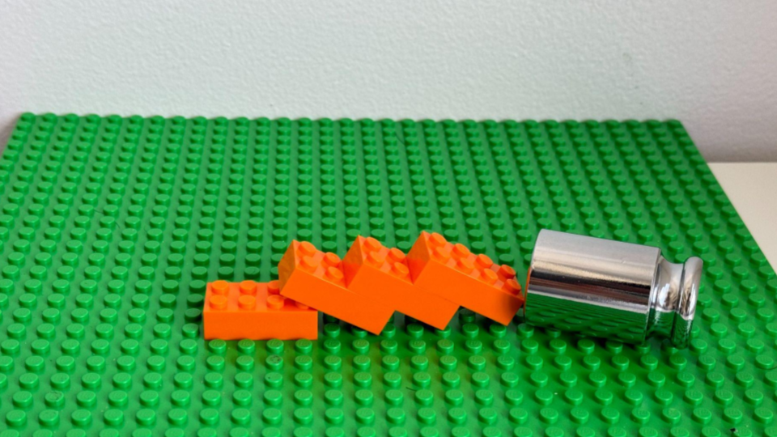

# StableLego
This repo contains the implementation of estimating the structural stability of block stacking assembly.

## Dependencies
* Gurobi
* Numpy
* Matplotlib

## Assembly Definition
Each assembly design is defined in a json file. Each step includes the brick x, y, z positions and orientation, along with the brick id, which is defined in the `lego_library.json`. Examples of Lego designs are available in `./test_lego/`.

## Examples of Structural Stabiliby Analysis

	
    
    
    
    
    
    <figcaption align="center">Left to right: 19-level stairs; 20-level stairs that collapses; improved 20-level stairs; a stick with 2 loads; a collapsing stick with 3 loads; a stable stick with 3 loads.</figcaption>
     
    
    
    
    
    
    
    <figcaption align="center">Stability analysis of the corresponding Lego structure. Black: more stable. Red: higher internal stress. White: collapsing bricks.</figcaption>

## Dataset
The StableLego dataset is available at [here](https://drive.google.com/file/d/1rcSVNjyjlxW698D5Ok_LKSLKK77r08-h/view?usp=sharing).

Each object in StableLego has
* `vox.npy`: the voxel representation of the object in a 3D matrix form.
* `task_graph.json`: the Lego assembly design of the object.
* `stability_score.npy`: the stability analysis result of the object with the given Lego layout design.
* `vis.png`: the visualization of the stability score.

	
    <figcaption>Examples of stable Lego structures in StableLego. Top: original object. Middle: stability analysis of the Lego layout. Bottom: Lego assembly in real.</figcaption>
     
    
    <figcaption>Examples of unstable Lego structures in StableLego. Top: original object. Middle: stability analysis of the Lego layout. Bottom: Lego assembly in real.</figcaption>

## Execution
1. Configurate the config file `./config.json`.
    * Set `Lego_fname` to the desired assembly design file name.
    * `Visualize_Analysis`: set to `1` if you want to visualize the analysis result.
    * `Print_Log`: set to `1` if you want to print out the solver log.
2. `python3 stability_analysis.py`.

## Extensions
The stability analysis can be extended to account for external loads.

	
    
    
    
    <!-- <figcaption>Examples of accounting for external loads. </figcaption> -->

